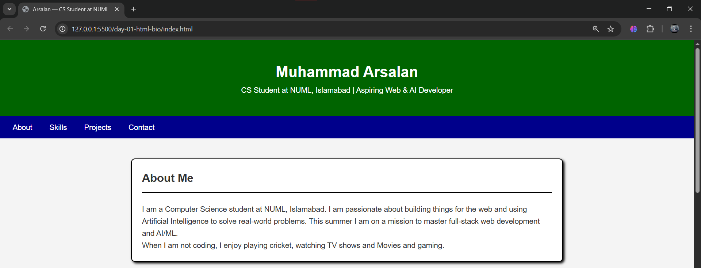
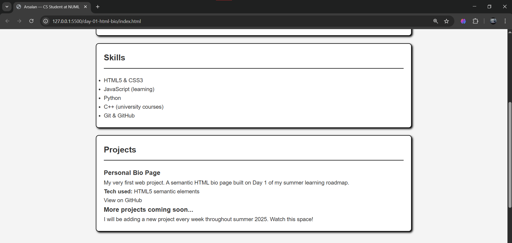
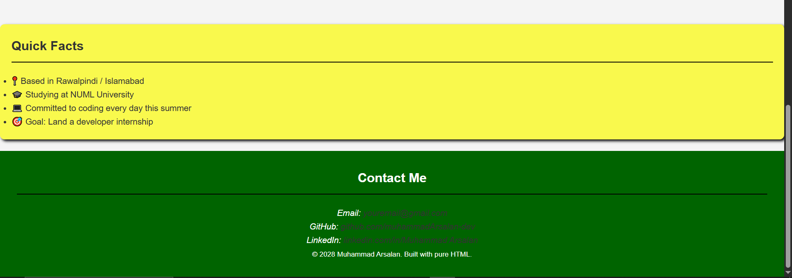

# Day 01 — HTML Bio Page

**Roadmap Phase:** 1 — Web Foundations  
**Date:** 1 May 2026

## What I Built
A personal bio page using only HTML5 semantic elements.  
No CSS, no JavaScript — just clean, meaningful HTML structure.

## What I Learned
- The difference between `
` and semantic tags like `<header>`, `<nav>`, `<main>`, `<section>`, `<article>`, `<aside>`, `<footer>`
- Why semantic HTML matters (accessibility, SEO, readability)
- How `<address>` works for contact info
- How `id` attributes let nav links jump to sections
- The `&amp;` entity for writing & in HTML

## Tags Used
`<!DOCTYPE html>` `<html>` `<head>` `<meta>` `<title>` `<body>`  
`<header>` `<nav>` `<main>` `<section>` `<article>` `<aside>` `<footer>`  
`<h1>` `<h2>` `<h3>` `
` `<ul>` `<li>` `<a>` `<strong>` `<small>` `<address>`

## Screenshot

## Next
Day 02 — HTML Forms: contact form + registration form