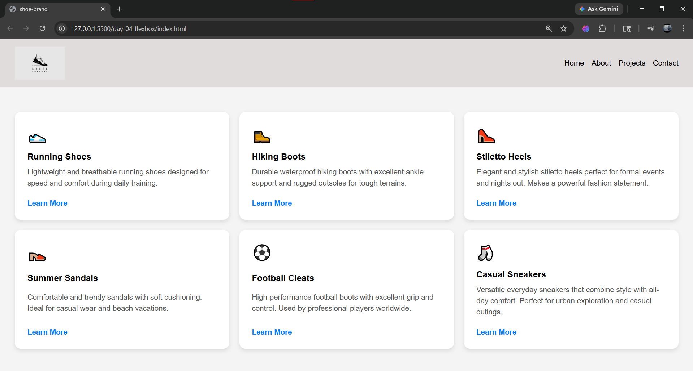

# Day 04 — FlexBox

**Roadmap Phase:** 1 — Web Foundations  
**Date:** 9 May 2026

## What I Built
I build a basic webpage having a horizontal navigation bar and card sections using
HTML and styling by using CSS flexbox property.

## What I Learned
- `justify-content` Aligns items along the main axis (horizontal in a row, vertical in a column) and `align-items` Aligns items along the cross    axis (the opposite direction — vertical in a row, horizontal in a column).
- `Main axis` The primary direction in which flex items are laid out. Controlled by flex-direction (default is left-to-right) and `Cross axis` The perpendicular direction (90 degrees) to the main axis.
- `flex-wrap: wrap` allows flex items to wrap onto new lines when they run out of space instead of shrinking or overflowing. For cards: It lets the cards flow into multiple rows on smaller screens (responsive behavior) instead of being forced into one row and becoming too narrow.
- `display: flex` makes the card a flex container, `flex-direction: column` stacks content vertically (main axis becomes vertical) and `justify-content: space-between` pushes the first and last items to the ends, with space in between.
- `transition` creates smooth animations when CSS properties change (like scale, shadow, color, etc.).
You put it on `.card` (the normal state), not on `:hover` because:
-It tells the browser: "Whenever these properties change, animate them smoothly."
-If you only put it on `:hover`, the animation works when hovering in, but snaps back instantly when hovering out.

## Properties Used

- `display: flex` — Used on `nav`, `.cards-container`, and `.card`
- `justify-content` — `space-between` & `center`
- `align-items: center`
- `flex-wrap: wrap` — Makes cards responsive
- `flex-direction: column` — For card internal layout
- `gap` — Spacing between nav links and cards
- `align-self: flex-start` — Aligns "Learn More" link
- `calc(33.333% - 20px)` — Responsive card width
- `transition` + `transform: translateY(-5px)` — Hover animation
- `box-shadow` & `border-radius` — Card styling
- `box-sizing: border-box`

## Screenshot

## Next
Day 05 — CSS Grid: Build a photo gallery or blog layout grid